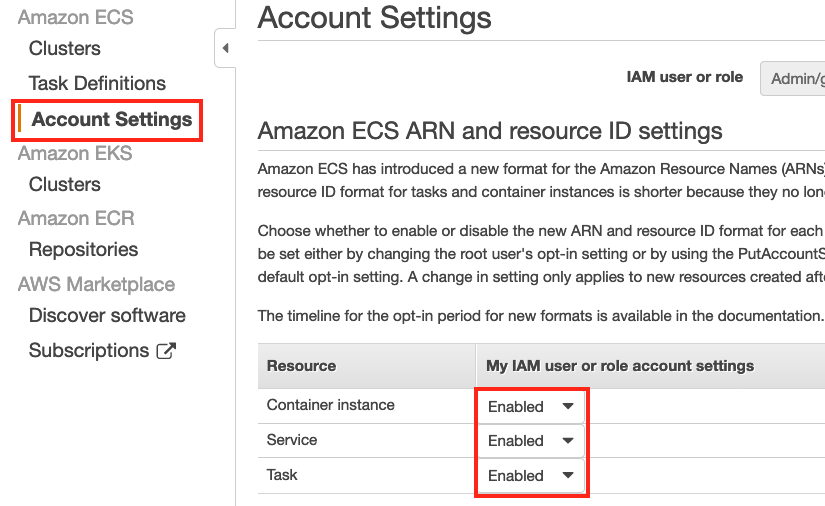
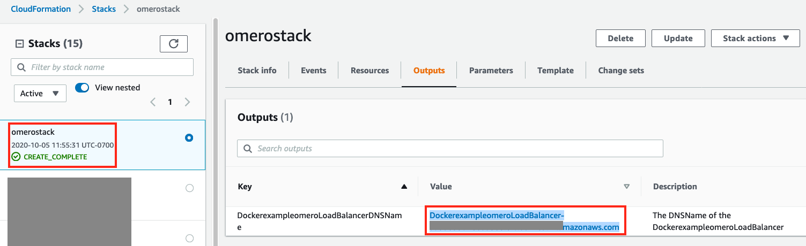

## Deploy OMERO on AWS

[OMERO](https://www.openmicroscopy.org/omero/) can be [deployed easily through docker compose](https://github.com/ome/docker-example-omero)

Docker compose CLI (`docker compose` is different from `docker-compose`) can deploy containers to [AWS ECS](https://aws.amazon.com/ecs/) following [this guide](https://docs.docker.com/engine/context/ecs-integration/). Make sure you have proposer [Amazon ECS account settings](https://docs.aws.amazon.com/AmazonECS/latest/developerguide/ecs-account-settings.html) before deployment, like 

You can generate an [AWS CloudFormation (CFN) template](https://aws.amazon.com/cloudformation/resources/templates/) from [the docker-compose.yml file in this repo](https://github.com/ome/docker-example-omero) through `docker compose convert`. The generated template will deploy on [Amazon ECS Fargate](https://docs.aws.amazon.com/AmazonECS/latest/developerguide/AWS_Fargate.html) with limited CPU and MEM requirements. To imporve the performance, a modified version of CFN template [OMEROonFargate.yml](https://github.com/flamingofugang/OMERO-on-AWS/blob/master/OMEROonFargate.yml) can be used in 1-click deployment:

[](https://console.aws.amazon.com/cloudformation/home?region=us-east-1#/stacks/create/template?stackName=omerostack&templateURL=https://omero-on-aws.s3-us-west-1.amazonaws.com/OMEROonFargate.yml) 

You can use your existing [AWS VPC and Subnet](https://docs.aws.amazon.com/vpc/latest/userguide/VPC_Subnets.html). If you have [HIPAA compliant](https://www.hhs.gov/hipaa/index.html) requirement, you can use the VPC and Subnet created through this [HIPAA Reference Architecture deployment](https://aws.amazon.com/quickstart/architecture/compliance-hipaa/).

After deployment, the DNS name can be obtained in the outputs of CFN stack: 

The Web UI can be accessed through: http://DNSname:4080/

If you want to use EC2 launch type for OMERO server instead of Fargate, you can use a different CFN template [OMEROonEC2.yml](https://github.com/flamingofugang/OMERO-on-AWS/blob/master/OMEROonEC2.yml) for 1-click deployment:

[](https://console.aws.amazon.com/cloudformation/home?region=us-east-1#/stacks/create/template?stackName=omeroec2stack&templateURL=https://omero-on-aws.s3-us-west-1.amazonaws.com/OMEROonEC2.yml)

You can use [Amazon EFS volumes](https://aws.amazon.com/efs/) as [persistent storage for OMERO server container running on Amazon ECS](https://aws.amazon.com/about-aws/whats-new/2020/04/amazon-ecs-aws-fargate-support-amazon-efs-filesystems-generally-available/), which can be [available through CFN deployment](https://aws.amazon.com/about-aws/whats-new/2020/08/amazon-ecs-announces-cloudformation-support-for-amazon-efs-volumes/) as well.

A modifed CFN template [OMEROonEC2EFSAccessPoint.yml](https://github.com/flamingofugang/OMERO-on-AWS/blob/master/OMEROonEC2EFSAccessPoint.yml) can be used for 1-click deployment:

[](https://console.aws.amazon.com/cloudformation/home?region=us-east-1#/stacks/create/template?stackName=omeroec2efsstack&templateURL=https://omero-on-aws.s3-us-west-1.amazonaws.com/OMEROonEC2EFSAccessPoint.yml)


The PostgreSQL database can run on [Amazon RDS](https://aws.amazon.com/rds/). Another CFN template [OMEROonEC2EFSRDS.yml](https://github.com/flamingofugang/OMERO-on-AWS/blob/master/OMEROonEC2EFSRDS.yml) can be used for 1-click deployment:

[](https://console.aws.amazon.com/cloudformation/home?region=us-east-1#/stacks/create/template?stackName=omeroec2efsrdsstack&templateURL=https://omero-on-aws.s3-us-west-1.amazonaws.com/OMEROonEC2EFSRDS.yml)

To install [AWS CLI](https://aws.amazon.com/cli/) and [omero-py](https://docs.openmicroscopy.org/omero/5.6.0/developers/Python.html) on the EC2 instance running OMERO server container, run the following scripts after login the instance:

```curl "https://awscli.amazonaws.com/awscli-exe-linux-x86_64.zip" -o "awscliv2.zip"  
unzip awscliv2.zip  
sudo ./aws/install  
curl -LO https://anaconda.org/anaconda-adam/adam-installer/4.4.0/download/adam-installer-4.4.0-Linux-x86_64.sh  
bash adam-installer-4.4.0-Linux-x86_64.sh -b -p ~/adam  
source ~/.bashrc  
echo -e '\n# Anaconda Adam\nexport PATH=~/adam/bin:$PATH' >> ~/.bashrc 
conda install -c anaconda libstdcxx-ng -y 
conda install -c anaconda libgcc-ng -y  
conda create -n myenv -c ome python=3.6 bzip2 expat libstdcxx-ng openssl libgcc zeroc-ice36-python omero-py -y   
sudo yum install java-11-amazon-corretto-headless
source activate myenv
```


The following blog posts and tutorials can be used for references:
1. [Tutorial on EFS for ECS EC2 launch type](https://docs.aws.amazon.com/AmazonECS/latest/developerguide/tutorial-efs-volumes.html).  
2. [Blog post on EFS for ECS Fargate](https://aws.amazon.com/blogs/aws/amazon-ecs-supports-efs/).  
3. [Blog post on EFS as Docker volume](https://aws.amazon.com/blogs/compute/amazon-ecs-and-docker-volume-drivers-amazon-ebs/)
